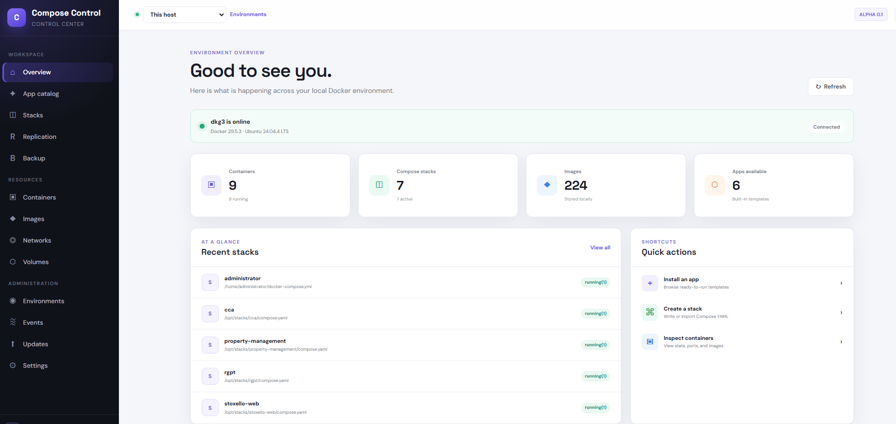

# ComposeControl

A C# and Blazor management interface for Docker and Docker Compose.


ComposeControl aims for the approachable stack workflow of [Dockge](https://github.com/louislam/dockge), a built-in
application catalog for one-click self-hosting, and progressively deeper environment management inspired by
[Portainer](https://www.portainer.io/). It runs as a single container, talks to your Docker host through the
Docker CLI, and stores everything it manages as plain Compose files on disk.

<!-- Add screenshots here, e.g.  -->

 

## Features

This is an early **alpha**. What works today:

- **Authentication** — ASP.NET Core Identity login, account management, and two-factor authentication
- **First-run setup** — a one-time wizard creates the initial administrator; public registration is disabled
- **Engine overview** — Docker host name, version, OS, and container/image counts, with graceful handling when the engine is offline
- **Containers** — discovery and filtering of all containers on the host
- **Stacks** — discovery of every Docker Compose project, plus ComposeControl-created stacks
- **App catalog** — a searchable, built-in catalog of popular self-hosted apps with parameterized Compose previews
- **One-click deploy** — install a catalog app into its own isolated stack directory
- **Stack editor** — create a new Compose stack from an in-app editor
- **Stack detail** — open a stack to view its containers and Compose definition
- **Lifecycle actions** — start, stop, restart, pull updates, and remove a stack
- **Edit & redeploy** — change the Compose file of a ComposeControl-managed stack and redeploy it

Container-level actions, logs, terminals, images, networks, volumes, remote environments, roles, audit events, and
ComposeControl self-update remain on the [roadmap](#roadmap).

### Built-in app catalog

| App | Category | Description |
| --- | --- | --- |
| Jellyfin | Media | Private media server for movies, shows, music, and photos |
| Immich | Photos | High-performance self-hosted photo and video backup |
| Uptime Kuma | Monitoring | Friendly monitoring dashboard for services and endpoints |
| PostgreSQL | Database | Production-grade relational database with persistent storage |
| Nginx Proxy Manager | Networking | Reverse proxy and TLS certificate management |
| Home Assistant | Automation | Open-source home automation with local-first control |

## Quick start (Docker)

This is the recommended way to run ComposeControl.

**Prerequisites**

- Docker Engine with the Docker Compose v2 plugin (`docker compose`)
- On Windows/macOS, Docker Desktop

**Run it**

```bash
# Clone the repository (or just grab compose.yaml)
git clone https://github.com/stoxello/compose-control.git
cd ComposeControl

docker compose up -d
```

Then open **http://localhost:8080**, create the initial administrator account, and sign in.

The bundled [`compose.yaml`](compose.yaml) pulls the published image `ghcr.io/stoxello/ComposeControl:latest`
(`pull_policy: always`), so you do not need to build anything. If you prefer not to clone the repo, create a
`compose.yaml` with the following contents:

```yaml
services:
  ComposeControl:
    image: ghcr.io/stoxello/compose-control:latest
    pull_policy: always
    container_name: ComposeControl
    restart: unless-stopped
    ports:
      - "${ComposeControl_PORT:-8080}:8080"
    volumes:
      - /var/run/docker.sock:/var/run/docker.sock
      - ./data:/app/data
      - ./keys:/app/keys
      - ./stacks:/opt/stacks
```

To use a different host port, set `ComposeControl_PORT` (for example in a `.env` file next to `compose.yaml`):

```bash
ComposeControl_PORT=9000
```

> If the GHCR package is private, run `docker login ghcr.io` once before `docker compose up -d`.

## Build from source

To build the image locally instead of pulling from GHCR, layer the build overlay over the base Compose file:

```bash
docker compose -f compose.yaml -f compose.build.yaml up -d --build
```

This builds from the repository [`Dockerfile`](Dockerfile) (a multi-stage build on the .NET 9 SDK that also copies the
Docker CLI and Compose plugin into the runtime image).

## Local development

**Prerequisites**

- [.NET 9 SDK](https://dotnet.microsoft.com/download)
- Docker Desktop or Docker Engine running locally

```bash
dotnet run --project ./src/ComposeControl.Web
```

Open **http://localhost:5146** (or https://localhost:7142), create the initial account, and sign in. Docker must be
running for engine data and deployments to work.

## Configuration

ComposeControl is configured through environment variables. The defaults below are what the container image ships with.

| Variable | Default (container) | Description |
| --- | --- | --- |
| `ComposeControl_PORT` | `8080` | Host port mapped to the container, set in the Compose `.env` |
| `ASPNETCORE_URLS` | `http://+:8080` | Address the app listens on inside the container |
| `ConnectionStrings__DefaultConnection` | `DataSource=/app/data/ComposeControl.db` | SQLite connection string for Identity and app data |
| `ComposeControl__StacksPath` | `/opt/stacks` | Directory where ComposeControl writes the Compose stacks it manages |
| `ComposeControl__DataProtectionPath` | `/app/keys` | Where ASP.NET Core data-protection keys are persisted |

**Account policy:** passwords must be at least 10 characters. Email confirmation is disabled (no SMTP is configured),
so accounts are usable immediately after creation.

### Persistent data

The Compose file mounts four volumes. Keep the three writable directories (`./data`, `./keys`, `./stacks`) to preserve
state across upgrades.

| Host path | Container path | Purpose |
| --- | --- | --- |
| `/var/run/docker.sock` | `/var/run/docker.sock` | Lets ComposeControl drive the host Docker engine |
| `./data` | `/app/data` | SQLite database (users, settings) |
| `./keys` | `/app/keys` | Data-protection keys — persisting these keeps logins valid across restarts |
| `./stacks` | `/opt/stacks` | Compose stacks created and managed by ComposeControl |

## Security

> **ComposeControl mounts `/var/run/docker.sock`. Access to this socket is equivalent to administrative control of the
> Docker host.**

- Keep ComposeControl behind a reverse proxy that terminates HTTPS, and do not expose it directly to the public internet.
- Public registration is disabled; only the first-run administrator can be created without authentication.
- Treat anyone who can reach the UI as a host administrator.

## How it works

ComposeControl is an ASP.NET Core / Blazor (Interactive Server) app. Rather than using a Docker SDK, it shells out to the
`docker` and `docker compose` CLIs and parses their JSON output, which keeps behavior identical to what you would run
by hand. Stacks it creates are written as ordinary `compose.yaml` (and `.env`) files under the stacks directory, so they
remain fully inspectable and portable. Managed stacks are sandboxed by name to that directory, and only stacks ComposeControl
created can be edited or rewritten from the UI.

## Project structure

```
src/ComposeControl.Web        Blazor UI, Identity, app catalog, and Docker services
  Components/            Razor pages and layouts (Apps, Stacks, Containers, Account)
  Services/              DockerCliService, StackService, AppDeploymentService, SetupService
  Data/                  EF Core DbContext and Identity migrations
tests/ComposeControl.Web.Tests  xUnit test suite
Dockerfile               Multi-stage build (SDK build -> aspnet runtime + docker CLI)
compose.yaml             Deployment Compose file (pulls from GHCR)
compose.build.yaml       Overlay to build the image from source
ghcr-publish.ps1         Build and publish the image to GitHub Container Registry
```

At runtime the container also uses:

- `stacks` — Compose projects installed by ComposeControl
- `data` — SQLite application database
- `keys` — persisted ASP.NET Core data-protection keys


## Roadmap

- Container-level actions, logs, and interactive terminals
- Image, network, and volume management
- Remote Docker environments
- Role-based access control and audit events
- ComposeControl self-update
